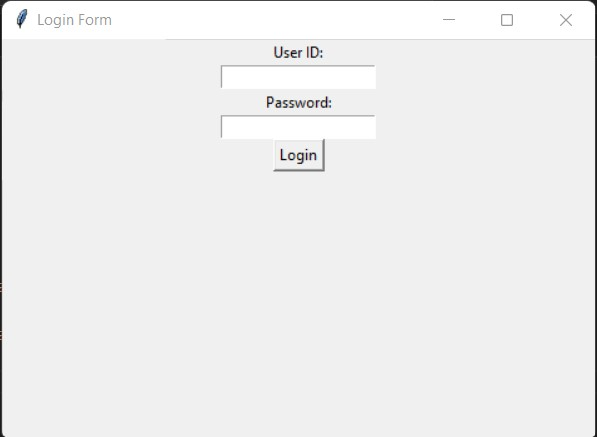

<!DOCTYPE html>
<html lang="en">
<head>
    <meta charset="UTF-8">
</head>
<body style="background-color:green;">
<body>
    <h1>🤗🤗🤗 Welcome to My Website 🤗🤗🤗</h1>
    
Hi This is my Web ,and i am Hari  
subscribe my YT channel 
Follow my insta ID
 
 
 
     
 
    Scan me to get freefire latest pro paid version for free
 
   
 
    <vedio>
<video width="320" height="240" controls>
<source src="  .mp4" type="video/mp4">
</video>
 
    <!-- Link -->
    <a href="https://youtube.com/@jonathanjames7..80?si=OCs3LgHGSCANqcdG" target="_blank">Subscribe my YT channel</a>
 
 
 
 
 <!-- Link -->
    <a href="https://www.instagram.com/harigovindhp?igsh=MWZlYzk1eWFkcTM0" target="_blank"> Follow my Instagram ID </a>
 
 
<a href="http://www.youtube.com/@ProgramIT-bd4nt" target="_blank">Subscribe my YT orginal programing channel</a>
 
 
 
               
      # this is a symple calculator python program:
            
      import time
      import webbrowser

      add=("3")
      substract=("4")
      multiply=("1")
      Devide=("2")
      
      
      print("This is a Calculator")
      time.sleep(2)
      print('select any option : ')
      print('1=multiply')
      print('2=Devide')
      print('3=add')
      print('4=substract')
      number1=input('Select any option: ')
     
      if number1 == multiply :
         print("multiply ")
          num1=input('Enter first number : ')
          num2=input('Enter second number : ')
           print('answer = ')
            print(num1 * num2)

      if number1 == Devide :
              print('Devide')
                numb1=input("Enter first number : ")
                  numb2=input("Enter second number : ")
                    print("Answer = ")
                      print(numb1 / numb2)
       
      if number1 == add :
              print('add')
                nu1=input('Enter first number : ')
                  nu2=input('Enter second number : ')
                     print('answer = ')
                        print(nu1 + nu2)
      if number1 == substract : 
                  print('substract')
                    numbe1=input('Enter first number : ')
                      numbe2=input('Enter second number : ')
                        print('answer = ')
                          print(numbe1 - numbe2)
      else:
           print('Invalid input')
            time.sleep(2)
             print('Try again')
              time.sleep(10)

         time.sleep(3)
          print('welcome to my website')
           time.sleep(3)
             webbrowser.open('https://github.com/RedytoHari/Kali-Hari.git')
               time.sleep(50)

               

 
 
Hi NOw my next code is a webbrowser hacking code 
 
 
Now to install requirments : Run this command in your command prompt or terminal  
 

        pip install TIME-python
 

        pip install web-browser

 
 
 
Now its the time to type the code : copy and paste the code in your ide or notpad and save with the extention of .py
 
 
 

    
    import time
    import webbrowser

    time.sleep(2)
    webbrowser.open('https://www.example.com')
    time.sleep(2)
    print("you are Hacked!")
    print("yes you are 😈😈😈")
    time.sleep(5)

 
 

Hi now my new code is to make a python login page 🤗🤗🤗
 
 
 
to install requirments run this commands in your commond prompt or terminal
 
 
 

       pip install tkinter-page
 
or
 
       
       pip install tk
       
 
 
 
                        
                 
           
           
       import tkinter as tk
    from tkinter import messagebox
        
       def validate_login():
       userid = username_entry.get()
       password = password_entry.get()
       # You can add your own validation logic here
       if userid == "Hacker" and password == "Commdir":
         messagebox.showinfo("Login Successful", "Welcome, Hacker!")
     else:
         messagebox.showerror("Login Failed", "Invalid username or password")
                 
      # Create the main window
      parent = tk.Tk()
      parent.title("Login Form")
              
      # Create and place the username label and entry
      username_label = tk.Label(parent, text="User ID:")
      username_label.pack()
      username_entry = tk.Entry(parent)
      username_entry.pack()
         
      # Create and place the password label and entry
      password_label = tk.Label(parent, text="Password:")
      password_label.pack()
      password_entry = tk.Entry(parent, show="*") # Show asterisks for password
      password_entry.pack()
         
      # Create and place the login button
      login_button = tk.Button(parent, text="Login", command=validate_login)
      login_button.pack()
          
      # Start the Tkinter event loop
      parent.mainloop()
                          
                              
  
 
 
now the screen shot is: 
 
 

 
 
 
I will update the web soon 🤗🤗🤗
 
 
 
 
                            
                 
 
               
 
</body>
</html>
